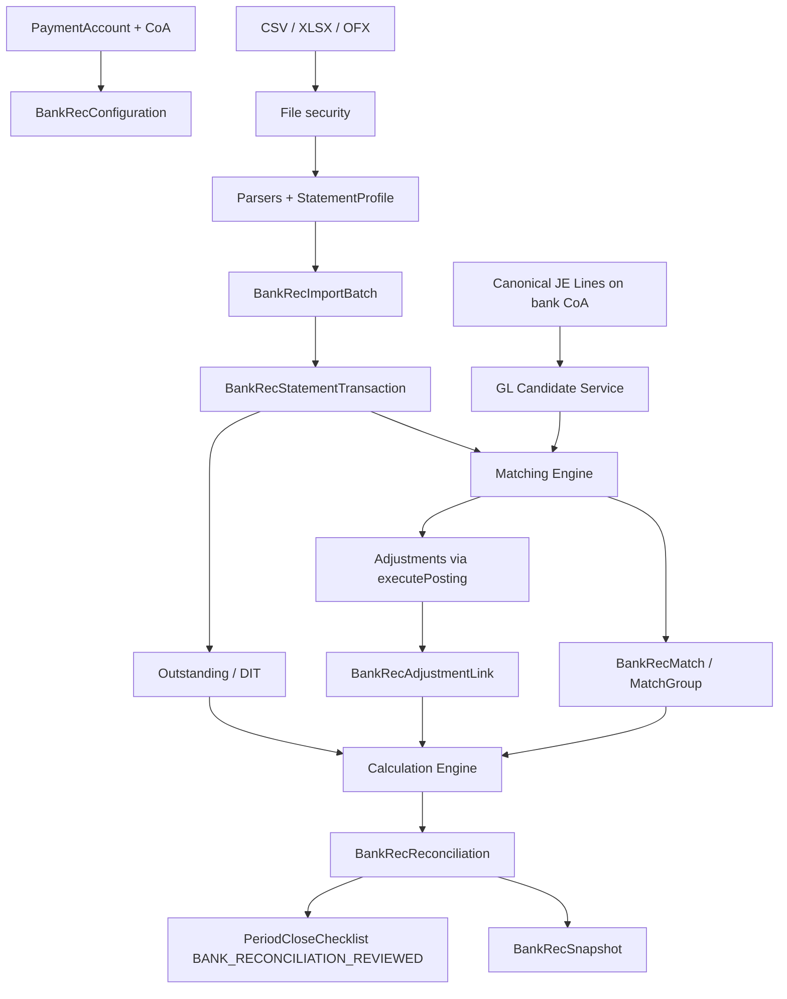

# Bank Reconciliation Data Flow Map

## End-to-end flow

## Signed-amount convention

All amounts are stored and compared in **bank-perspective signed minor units**:

- Credit / money in → positive  
- Debit / money out → negative  

Book-side JE lines are normalized to the same convention from debit/credit on the bank CoA asset (debit increases bank → positive).

## Import path

1. Upload validated (MIME, signature, size, row cap, formula injection).  
2. Hash file → idempotent batch per tenant + paymentAccount.  
3. Parse via profile → normalized rows.  
4. Fingerprint rows → duplicate detection within and across batches.  
5. Optional statement opening/closing balance validation.  
6. Rows become matchable evidence (`matchingStatus = UNMATCHED`).

## Matching path

1. Load unmatched statement rows for the recon session.  
2. Load GL candidates with remaining unmatched amount > 0.  
3. Rules engine scores EXACT → HIGH → MEDIUM → LOW / CONFLICTED.  
4. Auto-accept only at/above configured confidence.  
5. Manual accept / reject / split / partial / group (1:N, N:1, controlled N:N).  
6. Match records store links; JE lines remain immutable.

## Completion path

1. Calculation:  
   `clearedBook + outstandingPayments + depositsInTransit + adjustments ≈ statementClosing`  
2. Difference must be zero (within tolerance) to complete — **no plug**.  
3. Approve (SoD: completer ≠ preparer when configured).  
4. Atomic complete + immutable snapshot JSON.  
5. Reopen creates a new recon version; prior snapshot retained.

## Period close feed

`BANK_RECONCILIATION_REVIEWED` becomes AUTOMATIC when feature flag is on:

- PASS if every active reconcilable PaymentAccount has a COMPLETED recon covering the period end (or approved exception).  
- FAIL otherwise with evidence of accounts still open.
