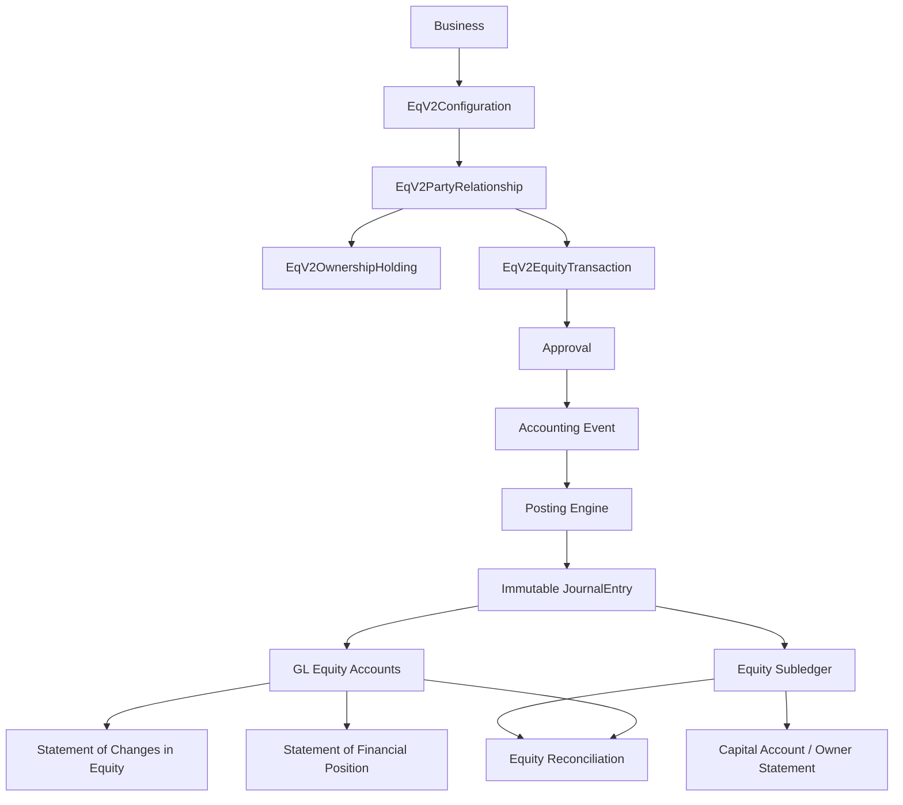

# Equity Data Flow Map

## Target flow



## Current (legacy) contribution path

```
Capital Account UI → /api/capital-account/contributions
  → postCapitalContributionAccounting (EQUITY / CAPITAL_CONTRIBUTION_POSTED)
  → executePosting → JournalEntry lines on Owner Capital + Bank/Asset
```

## Phase 11 financial event paths

| Event | Debit | Credit | Ownership effect |
|---|---|---|---|
| CAPITAL_CONTRIBUTION | Bank/Cash/Asset | Owner/Partner/Share Capital (+ Premium) | Explicit only |
| OWNER_DRAWING | Owner Drawings | Bank/Cash/Asset | None by default |
| DIVIDEND_DECLARED | RE / Dividends Declared | Dividends Payable | None |
| DIVIDEND_PAID | Dividends Payable | Bank (+ WHT payable) | None |
| SHARE_ISSUANCE | Bank/Receivable/Asset | Share Capital + Premium | New holding version |
| OWNER_LOAN_ADVANCE | Bank | Owner Loan Liability | None |
| OWNER_LOAN_CONVERSION | Owner Loan Liability | Equity (+ Premium) | Explicit |
| SHARE_TRANSFER | — (no company JE by default) | — | Holding movement only |

## Non-negotiable

- No plug journals.  
- No typed equity balances independent of JE.  
- No cascade-delete of owners with accounting history.  
- Cross-business owner/account/period IDs rejected.
