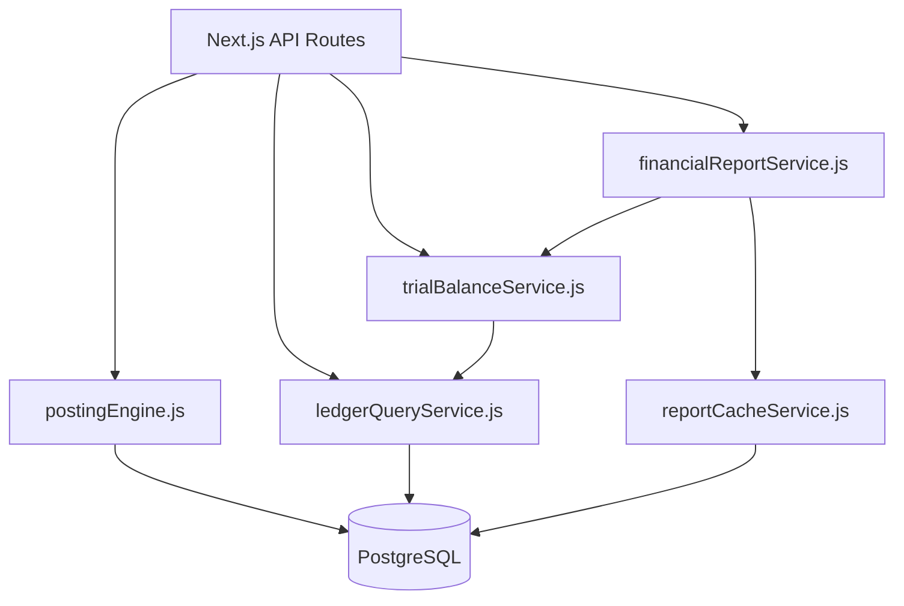

# Critical Path Inventory

Hot paths that dominate user-perceived latency, database load, and correctness risk. **Plans for each query path:** [QUERY_INVENTORY.md](./QUERY_INVENTORY.md).

---

## Tier 1 — Financial truth (must never degrade correctness)

| ID | Path | Entry APIs | Domain service | Primary tables |
|---|---|---|---|---|
| CP-01 | Operational posting | `POST /api/accounting-v2/posting-engine`, legacy invoice/expense/payment routes | `lib/accountingV2/engine/postingEngine.js` | `JournalEntry`, `JournalEntryLine`, `AcctV2EventRegistry`, `AcctV2OutboxMessage` |
| CP-02 | Manual journal | `POST /api/accounting-v2/journals` | `lib/accountingV2/application/manualJournalService.js` | Same as CP-01 |
| CP-03 | Reversal | `POST /api/accounting-v2/journals/[id]/reverse` | `lib/accountingV2/application/journalReversalService.js` | CP-01 + reversal links |
| CP-04 | Period close | `POST /api/accounting-close/runs`, period close APIs | `lib/accountingV2/periods/periodCloseService.js` | Period tables, snapshots, outbox |

**Invariant:** Idempotency keys, unique constraints, and atomic transactions — no shortcut paths.

---

## Tier 2 — Read-heavy accounting

| ID | Path | Entry APIs | Domain service | Notes |
|---|---|---|---|---|
| CP-10 | Ledger listing | `GET /api/accounting-v2/ledger` | `lib/accountingV2/ledger/ledgerQueryService.js` | `groupBy` sums; paginated lines |
| CP-11 | Account drill-down | `GET /api/accounting-v2/ledger/account/[id]` | `ledgerQueryService.js` | Running balance over window |
| CP-12 | Trial balance | `GET /api/accounting-v2/reports/generate` (TB) | `lib/accountingV2/reporting/trialBalanceService.js` | May use projection flag |
| CP-13 | Financial statements | Reports generate/export | `lib/accountingV2/reporting/financialReportService.js` | Cache via `AcctV2ReportCache` |
| CP-14 | Report drill-down | `GET /api/accounting-v2/reports/drill-down` | `financialReportService.js` + drill-down service | Regenerates or cache hit |
| CP-15 | Legacy GL | `GET /api/general-ledger` | Legacy + V2 adapters | Dual-read period |

---

## Tier 3 — Operational throughput

| ID | Path | Entry APIs | Notes |
|---|---|---|---|
| CP-20 | POS / sales | POS and invoice APIs | High frequency during retail hours |
| CP-21 | Expense capture | `POST /api/expenses/*` | Adapter → posting engine |
| CP-22 | Bank reconciliation match | `POST /api/bank-reconciliation/matches` | Batch candidate scans |
| CP-23 | Payroll run | `POST /api/payroll/enhanced` | Multi-line journals |
| CP-24 | Cron batch jobs | `app/api/cron/*` | `CRON_SECRET`; off-peak load |

---

## Tier 4 — Auth & platform

| ID | Path | Entry | Notes |
|---|---|---|---|
| CP-30 | Login | `POST /api/auth/login` | Rate limited in-memory |
| CP-31 | Session validation | Middleware / API guards | Every authenticated request |
| CP-32 | Health (planned) | `/api/system/health`, `/ready`, `/live` | `lib/performanceReliability/` |

---

## Dependency graph (simplified)

---

## Measurement priority (for baseline)

1. CP-01 posting p95/p99 under concurrent tenants
2. CP-12 trial balance with cache cold vs warm
3. CP-10 ledger pagination at max page size (500 lines)
4. CP-20 POS burst (ASSUMED profile in [WORKLOAD_MODEL.md](./WORKLOAD_MODEL.md))

---

## Cross-links

- [CURRENT_PERFORMANCE_ARCHITECTURE.md](./CURRENT_PERFORMANCE_ARCHITECTURE.md)
- [accounting-ledger/PERFORMANCE_VALIDATION.md](../accounting-ledger/PERFORMANCE_VALIDATION.md)
- [CRITICAL_PATH_INVENTORY.md](./CRITICAL_PATH_INVENTORY.md) → [DATA_CONSISTENCY_UNDER_LOAD.md](./DATA_CONSISTENCY_UNDER_LOAD.md)
