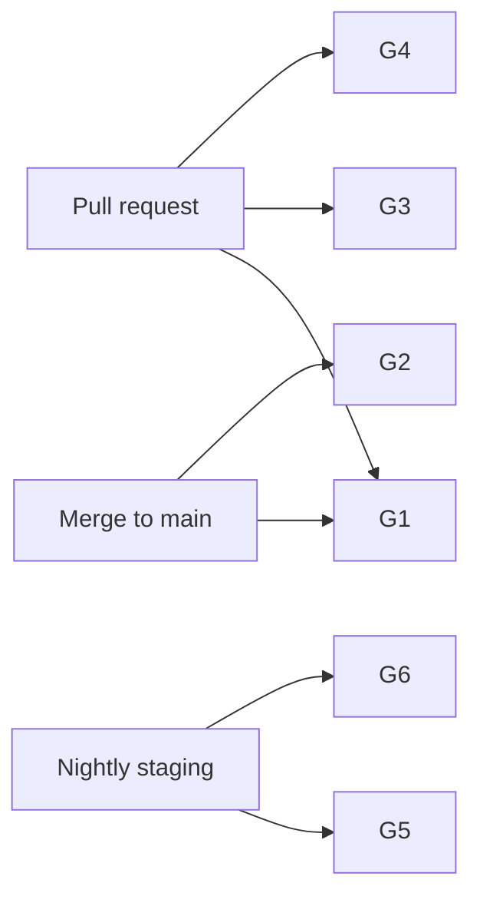

# CI Quality Gates

Quality gates for `.github/workflows/` and release paths. **Current:** single `accounting-verify.yml` job.

---

## Current pipeline

**File:** `.github/workflows/accounting-verify.yml`

| Step | Gate | Blocking | Notes |
|---|---|---|---|
| `npm ci` | deps install | Yes | Node 20 |
| `npx prisma generate` | client gen | Yes | |
| `npm test` | Vitest | Yes | **Would fail today** (55 failures) |
| `verify:accounting-scenario` | DB scenarios | **No** | Only if `secrets.DATABASE_URL` |

---

## Target gates (Phase 16 exit)

### Gate G1 — Unit tests green (mandatory)

```yaml
- name: Unit tests
  run: npm test
```

| Criteria | Threshold |
|---|---|
| Exit code | 0 |
| Failures | 0 |
| Skipped | Allowed; report count |

**Owner:** AV | **Status:** IN_PROGRESS

---

### Gate G2 — Coverage (mandatory on main)

```yaml
- name: Coverage
  run: npm run test:coverage
```

| Path | Lines | Branches |
|---|---|---|
| `lib/accountingV2/**` | ≥70% | ≥60% |
| `lib/securityGovernance/**` | ≥70% | ≥60% |

**Owner:** BB | **Status:** NOT_STARTED

---

### Gate G3 — Middleware catalogue (mandatory on PR)

```yaml
- name: Middleware catalogue
  run: npm test -- test/qa/middleware-catalogue.test.js
```

Fails if any `/api` route lacks `tenantApiAccess` rule (GAP-SEC-011).

**Owner:** BH | **Status:** NOT_STARTED

---

### Gate G4 — Security regression (mandatory on PR touching auth/suppliers)

```yaml
- name: Security regression
  run: npm test -- test/securityGovernance.* test/qa/supplier-idor.test.js test/qa/reversal-authz.test.js
```

**Owner:** BF–BK | **Status:** NOT_STARTED

---

### Gate G5 — DB scenario (mandatory on staging nightly)

```yaml
- name: Accounting scenario verification
  run: npm run verify:accounting-scenario -- --tenant=QA-Accounting
  env:
    DATABASE_URL: ${{ secrets.STAGING_DATABASE_URL }}
```

All 7 scenarios must pass.

**Owner:** AX | **Status:** IN_PROGRESS (optional in PR workflow today)

---

### Gate G6 — Skipped test budget (advisory → mandatory)

| Branch | Max skipped cases |
|---|---|
| PR | ≤30 (includes 23 retired) |
| main | ≤25 after GAP-QA-017 archive |

**Owner:** AY | **Status:** NOT_STARTED

---

## Workflow layout (target)



---

## Required checks (GitHub branch protection)

| Check name | When required |
|---|---|
| `Accounting verify / verify` | All PRs (existing) |
| `Accounting verify / coverage` | main only (planned) |
| `Security regression` | PRs with `security` label or auth path changes (planned) |

---

## Failure triage

| Gate fail | Action |
|---|---|
| G1 unit | Block merge; fix or waiver (S) |
| G2 coverage | Block main; add tests or waiver |
| G3 middleware | Block merge; register prefix |
| G4 security | Block merge; no waiver without security review |
| G5 scenario | Block staging promote; finance notified |
| G6 skip budget | Review skip register |

---

## Local pre-push (recommended)

```bash
npx prisma generate && npm test
# optional:
npm run verify:accounting-scenario -- --tenant=QA-Accounting
```

---

## Related

- `TEST_COVERAGE_POLICY.md`
- `FLAKY_TEST_POLICY.md`
- `RELEASE_CERTIFICATION_PROCESS.md`
