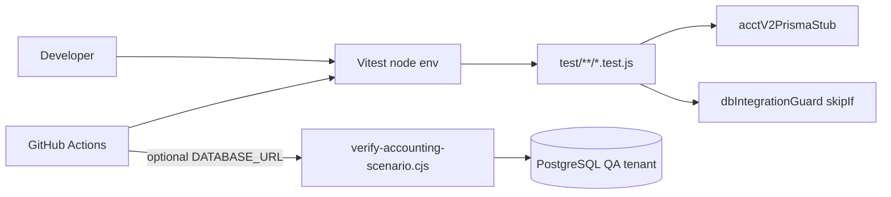

# Current Test Architecture

Repository-evidence description of how InsightBooks V2 is tested today (July 2026).

---

## Stack overview



| Component | Present | Notes |
|---|---|---|
| Unit runner | **Vitest 3.x** | `npm test` → `vitest run` |
| Environment | **Node only** | No jsdom, no browser |
| Pattern | `test/**/*.test.js` | 95 files |
| E2E (Playwright/Cypress) | **No** | Not in `package.json` |
| Testcontainers | **No** | CI uses secrets-based real DB |
| Coverage | **No** | No `coverage` block in `vitest.config.js` |
| Snapshot testing | Minimal | Excel export byte checks in reports tests |
| Mocking | `vi` from Vitest | Posting engine, audit stubs |

---

## Configuration

```1:17:vitest.config.js
import path from 'node:path';
import { fileURLToPath } from 'node:url';
import { defineConfig } from 'vitest/config';

const __dirname = path.dirname(fileURLToPath(import.meta.url));

export default defineConfig({
  resolve: {
    alias: {
      '@': path.resolve(__dirname, '.'),
    },
  },
  test: {
    environment: 'node',
    include: ['test/**/*.test.js'],
  },
});
```

**Implications:**
- `@/` alias matches app imports.
- No `setupFiles`, `globalSetup`, or timeout overrides.
- Tests outside `test/` (e.g. colocated) are **not** discovered.

---

## Test inventory by domain

| Domain | Files | Approx. cases | Primary files |
|---|---|---|---|
| Accounting V2 core | 12 | ~350 | `accountingV2.*.test.js` |
| CoA V2 + legacy CoA | 18 | ~180 | `coaV2.*`, `coa*.test.js` |
| Security / authz | 2 | 37 | `securityGovernance.engine.test.js`, `authz.test.js` |
| Bank reconciliation | 4 | 43 | `bankReconciliation.*.test.js` |
| Equity / close / planning / loan | 8 | ~80 | module `*.test.js` |
| Legacy engine / POS / HR / tax | 51 | ~179 | assorted `test/*.test.js` |

**Total (July 2026 run):** 869 cases — 791 passed, 55 failed, 23 skipped across 95 files (13 failed files, 1 skipped file).

---

## Helpers

### `test/helpers/acctV2PrismaStub.js`

In-memory Prisma delegate for Accounting V2 kernel tests:
- Unique constraint on event registry (throws `P2002`)
- Real `$transaction` rollback via snapshot/restore
- `simulateRaceOnce` for concurrent duplicate path
- Seeds: eventRegistry, accounts, periods, repair, reports, etc.

Used by: all `accountingV2.*.test.js` posting/ledger/periods/repair/reports suites.

### `test/helpers/dbIntegrationGuard.js`

```javascript
export async function tenantExistsForIntegration(tenantId) {
  // Prisma findUnique on Tenant; disconnect in finally
}
```

Used with:
```javascript
const tenantReady = await tenantExistsForIntegration('QA-Accounting');
describe.skipIf(!tenantReady)('...', () => { ... });
```

**Files:** `expenseCoaCategoryPicker.test.js`, `salaryAdvanceGlAccount.test.js`, `coaExpenseTenantPipeline.test.js`.

---

## Skip patterns

| Pattern | Location | Reason |
|---|---|---|
| `describe.skip(...)` | `accountingV2.posting.test.js` (4 blocks) | Retired `postAccountingEvent` API |
| `describe.skip(...)` | `accountingV2.postingEngine.test.js` (1 block) | Shadow invoice posting removed |
| `describe.skipIf(!tenantReady)` | 3 CoA/expense files | QA tenant absent in CI without DB |

---

## Floating-point assertions

`toBeCloseTo` used in:
- `accountingV2.reports.test.js` (KPI ratios, Excel export)
- `coaRollupInventory.test.js` (balance rollups)
- `loanReadiness.engine.test.js` (DSCR ratios)
- `saleItemBaseQuantity.test.js` (unit conversion)

No project-wide decimal policy in tests; most money tests use integer minor units via `test/money.test.js`.

---

## CI pipeline

```yaml
# .github/workflows/accounting-verify.yml (abbreviated)
- npm ci
- npx prisma generate
- npm test                          # required
- npm run verify:accounting-scenario  # if secrets.DATABASE_URL
```

**Gaps:**
- CI does **not** fail fast on skipped DB suites (they pass as skipped).
- No coverage threshold gate.
- No separate security test job.
- 55 failing tests would fail CI if run today.

---

## DB scenario script

`scripts/verify-accounting-scenario.cjs` — read-only GL integrity for tenant `QA-Accounting`:

| Scenario key | Check |
|---|---|
| `pos-sale-gl` | Posted Sale + Sale-COGS |
| `invoice-accrual-gl` | Invoice accrual GL |
| `expense-approved-gl` | Expense GL |
| `trial-balance` | TB debits = credits |
| `txn-balance` | Per-txn balance |
| `source-idempotency` | No duplicate sourceType+sourceId |
| `ar-subledger` | AR 1200 vs invoices |

Manifest: `scripts/.qa-scenario-manifest.json`.

---

## What is NOT tested today

| Area | Status |
|---|---|
| HTTP route handlers (most modules) | Manual / absent |
| Middleware catalogue completeness | **NOT_STARTED** |
| SEC-2 supplier IDOR | **NOT_STARTED** |
| Session tamper / revocation | **NOT_STARTED** |
| Playwright UI flows | **NOT_STARTED** |
| PostgreSQL RLS | N/A (not implemented) |
| Load / performance | **NOT_STARTED** |

See `TARGET_TEST_ARCHITECTURE.md` and `TEST_GAP_REGISTER.md`.
