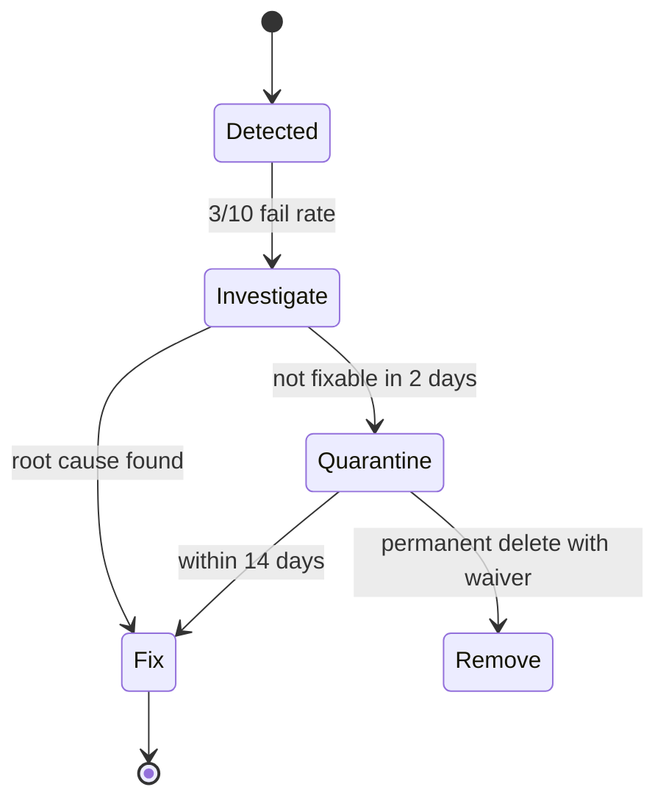

# Flaky Test Policy

Defines how InsightBooks V2 identifies, quarantines, and resolves **flaky** tests (non-deterministic pass/fail).

---

## Definition

A test is **flaky** if it produces different outcomes without code changes across ≥3 of 10 consecutive runs in the same environment.

**Not flaky (July 2026):** The 55 currently failing tests — they fail **deterministically** (fixture drift, legacy API removal). Track under GAP-QA-001, not quarantine.

---

## Detection

| Method | When |
|---|---|
| CI re-run mismatch | Automatic flag when re-run passes after fail |
| Local `vitest --retry=3` hook | Optional pre-merge for changed files |
| Nightly 10× shard | Phase 17 for `accountingV2.reports.test.js` |

---

## Response workflow

1. **Investigate** — timing, DB state, float precision, race.
2. **Fix preferred** — stub isolation, `await` drains, integer money.
3. **Quarantine** — `describe.skip` with `FLAKY-<id>` comment + issue link.
4. **Remove** — only with waiver W-FLAKY-RETIRE.

---

## Quarantine rules

| Rule | Detail |
|---|---|
| Max quarantined cases | 5 repo-wide without QA lead approval |
| Max quarantine duration | 14 calendar days |
| CI behaviour | Quarantined tests excluded from G1 count via explicit list file `test/.quarantine.json` (planned) |
| Documentation | Update `FLAKY_AND_SKIPPED_TEST_REGISTER.md` same PR |

---

## Floating-point tests

Files using `toBeCloseTo` (watch list, not currently flaky):

- `accountingV2.reports.test.js`
- `coaRollupInventory.test.js`
- `loanReadiness.engine.test.js`
- `saleItemBaseQuantity.test.js`

**Policy:** Prefer integer minor units for money; if `toBeCloseTo` required, document precision in test name.

---

## Async / DB tests

| Pattern | Risk | Mitigation |
|---|---|---|
| `describe.skipIf(!tenantReady)` | Skip ≠ flake | Run on staging nightly (G5) |
| Shared Prisma client | Connection leak | `dbIntegrationGuard` disconnects |
| Race idempotency | Intentional | `simulateRaceOnce` in stub — not flaky |

---

## Responsibilities

| Role | Duty |
|---|---|
| Author | Fix or quarantine within PR |
| QA lead | Approve quarantine >5 cases |
| Tech lead | Approve extension past 14 days |

---

## Related

- `TEST_WAIVER_GOVERNANCE.md` — W-FLAKY-* waivers
- `CI_QUALITY_GATES.md` — Gate G6 skip budget
- `FLAKY_AND_SKIPPED_TEST_REGISTER.md` — inventory
