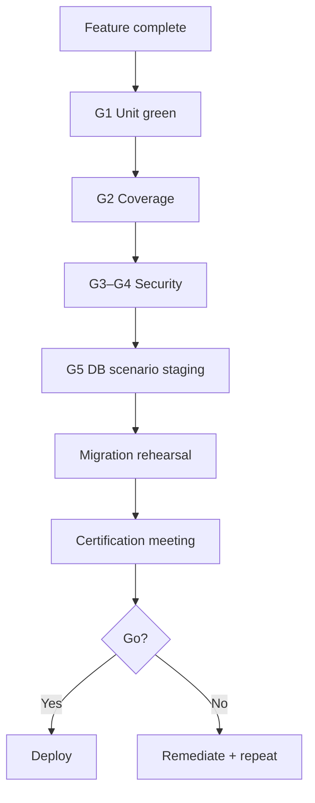

# Release Certification Process

Step-by-step procedure to certify an InsightBooks V2 release for staging promotion or production cutover.

---

## Overview



---

## Step 1 — Automated pre-checks (required)

Run on release candidate SHA:

```bash
npm ci
npx prisma generate
npm test
npm run test:coverage          # when BA complete
npm test -- test/securityGovernance.* test/qa/*
npm run verify:accounting-scenario -- --tenant=QA-Accounting
```

| Check | Gate | Pass |
|---|---|---|
| Unit tests | G1 | exit 0 |
| Coverage | G2 | thresholds met |
| Security suites | G4 | exit 0 |
| DB scenarios | G5 | all 7 ✅ |

Attach CI run URLs to certification packet.

---

## Step 2 — Invariant spot-check

From `ACCOUNTING_INVARIANT_CATALOGUE.md`, confirm **Critical** invariants on pilot tenant:

| Invariant | Manual / auto |
|---|---|
| ACC-INV-001 balanced journals | scenario `txn-balance` |
| ACC-INV-023 AR control | scenario `ar-subledger` |
| ACC-INV-035 capital once | BS review + EQT-035 |
| ACC-INV-012 salary 5200 | payroll mapping sample |
| SEC-INV-009 no SEC-2 | supplier route test |

---

## Step 3 — Migration rehearsal evidence

If release includes migration scripts:

1. Execute `MIGRATION_REHEARSAL_RUNBOOK.md` on staging within 7 days.
2. Attach baseline + post JSON artefacts.
3. Confirm rollback drill succeeded (Phase 5).

**Waiver:** W-MIG max 7 days — requires finance approval.

---

## Step 4 — Open gap review

| Severity | Policy |
|---|---|
| Critical GAP-QA / GAP-SEC | **Block** release |
| High | Block unless compensating control + waiver |
| Medium/Low | Document in packet; fix by next patch |

Source: `TEST_GAP_REGISTER.md`, `docs/security-governance/SECURITY_CONTROL_GAP_REGISTER.md`.

---

## Step 5 — Waiver audit

List all active waivers from `TEST_WAIVER_GOVERNANCE.md`. Confirm none expired. Security waivers (W-SEC) require security reviewer signature.

---

## Step 6 — Certification meeting

**Attendees:** Release manager, Engineering lead, QA lead, Security (if auth changes), Finance (if GL/report changes).

**Agenda:**
1. CI evidence review (Step 1)
2. Pilot tenant financial review (Step 2)
3. Migration rehearsal (Step 3) if applicable
4. Residual risks (`RISK_REGISTER.md`)
5. Go / no-go vote

**Output:** Signed `artifacts/quality-assurance/certification-<version>.md`

---

## Certification record template

```markdown
# Release Certification — vX.Y.Z

- **RC SHA:**
- **Date:**
- **Environment:** staging | production

## Automated gates
- [ ] G1 unit
- [ ] G2 coverage
- [ ] G3 middleware
- [ ] G4 security
- [ ] G5 DB scenario

## Manual / rehearsal
- [ ] Migration rehearsal (link)
- [ ] Finance TB/BS sign-off
- [ ] Rollback drill

## Open items
(list gaps with waivers)

## Decision: GO / NO-GO

Signatures:
```

---

## Post-release

| Window | Action |
|---|---|
| 0–48h | Monitor G5 nightly; audit delta |
| 7d | Retrospective on failures/waivers |
| 30d | Update coverage baseline |

---

## Related

- `PHASE_18_READINESS.md`
- `CI_QUALITY_GATES.md`
- `MIGRATION_REHEARSAL_RUNBOOK.md`
