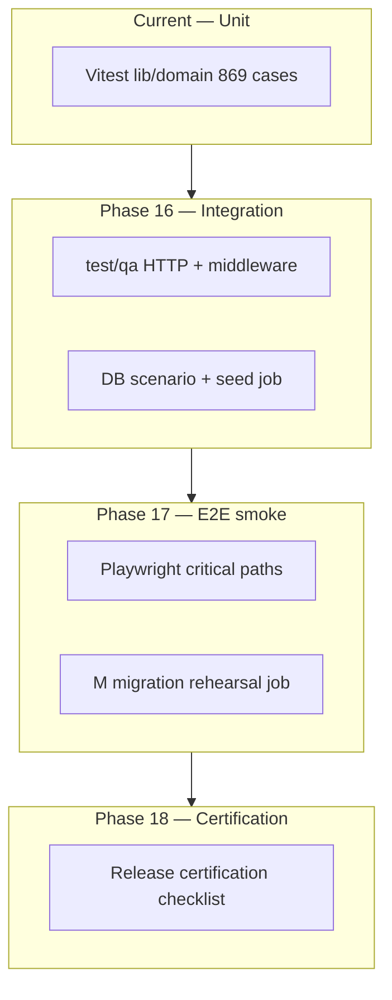

# Target Test Architecture

End-state test pyramid for InsightBooks V2 after Phase 16 (infra) and Phase 17 (expansion). **Not fully implemented** — statuses marked per layer.

---

## Pyramid



| Layer | Tooling | Scope | Target count | Status |
|---|---|---|---|---|
| L1 Unit | Vitest (node) | `lib/**`, domain, stubs | 900+ cases, 0 fail | **IN_PROGRESS** (55 fail) |
| L2 Integration | Vitest + supertest/fetch | `app/api/**`, middleware | 80+ cases in `test/qa/` | **NOT_STARTED** |
| L2b DB read-only | `verify-accounting-scenario.cjs` | QA tenant invariants | 7 scenarios + extensions | **PARTIAL** (optional CI) |
| L3 E2E smoke | Playwright | Login, TB, invoice post | 5–10 specs | **NOT_STARTED** (Phase 17) |
| L4 Certification | Manual + scripted | Staging sign-off | Per release | **NOT_STARTED** (Phase 18) |

---

## Directory layout (target)

```
test/
├── helpers/
│   ├── acctV2PrismaStub.js          # EXISTS
│   ├── dbIntegrationGuard.js        # EXISTS
│   ├── httpTestClient.js            # PLANNED — session cookie helper
│   └── qaTenantFactory.js           # PLANNED — seed minimal CoA
├── qa/                              # NEW — integration & regression
│   ├── middleware-catalogue.test.js
│   ├── supplier-idor.test.js        # SEC-2
│   ├── reversal-authz.test.js       # SEC-3
│   ├── capital-authz.test.js        # SEC-4
│   ├── equity-approval.test.js
│   ├── loan-readiness-sod.test.js
│   ├── webhook-replay.test.js
│   ├── ai-governance.test.js
│   └── liability-journal-link.test.js
├── securityGovernance.policy.test.js   # PENDING Phase 15 BW
├── securityGovernance.sod.test.js      # PENDING Phase 15 BX
├── securityGovernance.session.test.js  # PENDING Phase 15 BY
├── accountingV2.*.test.js              # EXISTS
└── e2e/                             # Phase 17
    └── smoke/
        ├── login.spec.js
        └── trial-balance.spec.js
```

---

## Vitest configuration (target)

Extend `vitest.config.js`:

```javascript
test: {
  environment: 'node',
  include: ['test/**/*.test.js', 'test/qa/**/*.test.js'],
  exclude: ['test/e2e/**'],
  coverage: {
    provider: 'v8',
    reporter: ['text', 'lcov'],
    include: ['lib/accountingV2/**', 'lib/securityGovernance/**', 'lib/coaV2/**'],
    thresholds: { lines: 70, functions: 65, branches: 60 },
  },
  testTimeout: 30_000,
  hookTimeout: 30_000,
},
```

Status: **NOT_STARTED** (GAP-QA-002).

---

## CI target (see `CI_QUALITY_GATES.md`)

| Job | Trigger | Required |
|---|---|---|
| `unit` | all PRs | pass, 0 failures |
| `coverage` | PR to main | thresholds met |
| `db-scenario` | nightly + staging | all 7 scenarios green |
| `middleware-catalogue` | all PRs | no unlisted `/api` prefix |
| `e2e-smoke` | nightly | Phase 17 |

---

## Test doubles strategy

| Concern | Current | Target |
|---|---|---|
| Accounting V2 Prisma | `acctV2PrismaStub` | Keep; extend for new models |
| Audit engine | Inline stub in test file | Extract `auditPrismaStub.js` |
| HTTP | None | `httpTestClient` with signed test session |
| External AI | None | Mock fetch; no live LLM in CI |
| File uploads | Engine unit tests | Temp dir + gateway mock |

---

## Security test alignment

Map to Phase 15 workstreams BW–BZ:

| Suite | THR coverage | GAP-SEC |
|---|---|---|
| `securityGovernance.policy.test.js` | THR-007–016 | 013, 014, 015, 016 |
| `securityGovernance.sod.test.js` | THR-016–020 | 005, 006 |
| `securityGovernance.session.test.js` | THR-002, 003 | 001, 002, 003 |
| `test/qa/middleware-catalogue.test.js` | THR-013, 014 | 011, 012 |
| `test/qa/supplier-idor.test.js` | THR-007 | 013 |

**Minimum bar (Phase 16 gate):** 90% of THR-007–THR-016 scenarios automated (`docs/security-governance/PHASE_16_READINESS.md`).

---

## Non-goals (Phase 16)

- Full Playwright regression of all UI modules
- Testcontainers in default developer workflow
- 100% line coverage repo-wide
- Performance/load testing

Deferred to Phase 17–18 per `PHASE_17_READINESS.md` / `PHASE_18_READINESS.md`.
