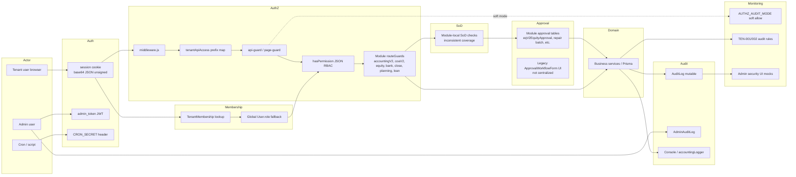
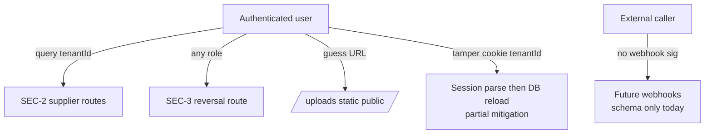
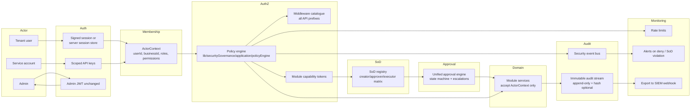
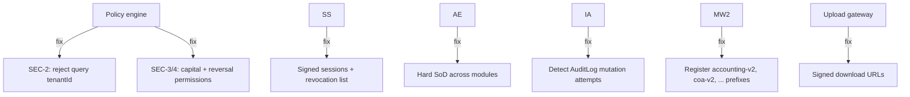
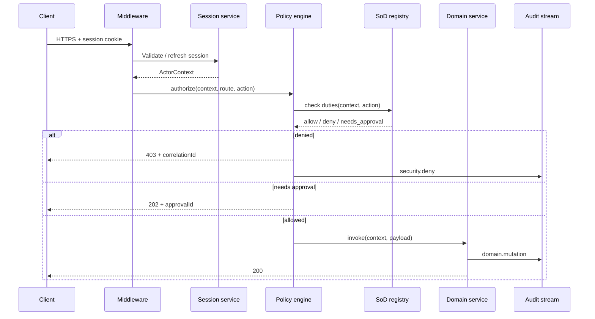

# Security Data Flow Map

Control-plane data flows for authentication, authorization, separation of duties, approvals, domain execution, audit, and monitoring. **Current** reflects as-built code; **target** reflects Phase 15 `lib/securityGovernance/` design.

---

## Current state

### Current flow notes

1. **Actor → Auth:** Tenant auth is cookie-only; no server session row. Admin is separate JWT plane.
2. **Auth → Membership:** Every `getUserFromSession` reloads user; membership overrides role.
3. **Membership → AuthZ:** Middleware enforces session + prefix permissions; V2 module prefixes **missing from map** — blocked at middleware unless public (handlers add second guard).
4. **AuthZ → SoD:** Only if module implements it; legacy routes often skip.
5. **SoD → Approval:** Per-module tables; no shared state machine.
6. **Approval → Domain:** Approved actions call domain services; some paths auto-approve.
7. **Domain → Audit:** Best-effort `AuditLog.create`; deletions possible.
8. **Audit → Monitoring:** Partial — accounting audit rules for tenancy; security monitoring mostly admin UI placeholders.

### High-risk bypass paths (current)

---

## Target state (Phase 15)

### Target flow guarantees

| Step | Guarantee |
|---|---|
| Actor → Auth | All tenant identities resolve to **`ActorContext`**; client never supplies `businessId` (extends ADR-005 / P2-02) |
| Auth → Membership | Membership + branch + permission snapshot cached in signed session or server store |
| Membership → AuthZ | **Single policy evaluation** — middleware and handlers call same engine |
| AuthZ → SoD | Deny or escalate when preparer = approver for protected action classes |
| SoD → Approval | Pending approvals block domain mutation; unified inbox API |
| Approval → Domain | Domain receives `{ context, approvalId, evidence }` bundle |
| Domain → Audit | Every security-relevant decision emits immutable event |
| Audit → Monitoring | Rate limit + alert on repeated denies, cross-tenant attempts, audit tamper |

### Target remediation of known gaps

---

## Sequence: authenticated API request (target)

---

## Related documents

- `CURRENT_SECURITY_ARCHITECTURE.md` — component detail
- `TARGET_SECURITY_ARCHITECTURE.md` — `lib/securityGovernance/` module design
- `THREAT_MODEL.md` — threat ↔ control mapping
