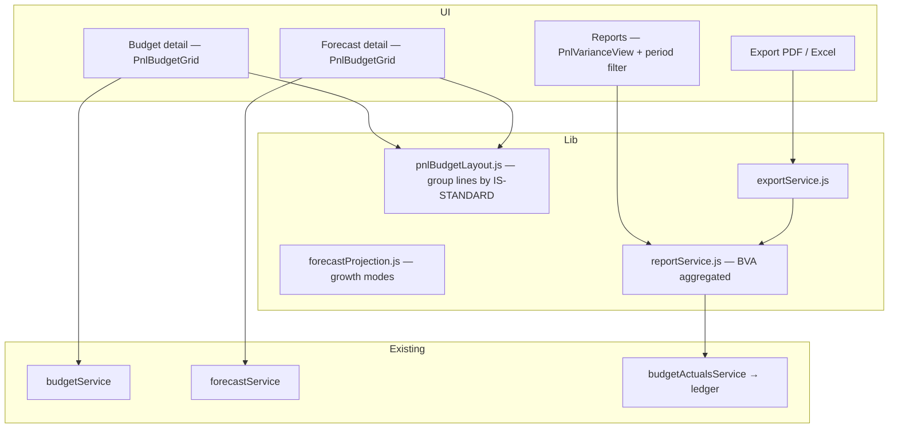

# Budget & Forecast — Simple P&L-Grouped Module

**Date:** 2026-08-18  
**Status:** Approved 2026-08-18  
**Scope:** Evolve `/budget-forecast/` (budgets, forecasts, reports) for owner-friendly P&L-aligned planning  
**Decision:** Account-based rows grouped into P&L sections; keep UX as simple as possible

## Goal

Give a normal business owner a **forward-looking Profit & Loss** they can understand:

**Create Budget → Apply growth or enter amounts → Project income & expenses → See profit → Compare vs actual → Export projection**

No advanced accounting knowledge required, but rows remain **real chart-of-accounts lines** (flexible, reconciles with ledger actuals).

## Non-goals

- Replacing Accounting V2 P&L or posting journals from budgets/forecasts
- Building a second parallel planning stack (PlanV2 / financial-planning remain separate)
- Full three-statement modelling in this phase
- Per-department / capex budget types in the simplified grid (advanced mode can remain elsewhere)

## Principles

1. **Same structure as P&L** — section headers and calculated totals match `INCOME_STATEMENT_V1` in `lib/accountingV2/reporting/reportDefinitions.js`.
2. **Account rows, not template fiction** — each editable row is a CoA account; amounts roll up into section subtotals and profit lines.
3. **Simple by default** — hide infrequent sections (depreciation, finance costs, corporate tax) behind “Show advanced P&L lines”; default view matches the owner spec.
4. **Never post** — budgets and forecasts remain planning-only; actuals are read-only from the ledger.
5. **Reuse greenfield stack** — `PlanningBudget`, `PlanningForecast`, `lib/budgetForecast/*`, existing APIs.

---

## 1. P&L section layout (default simple view)

The budget/forecast grid renders as a **hierarchical table**, not a flat account list.

### Section structure

| Order | Section | Type | User-facing label |
| --- | --- | --- | --- |
| 1 | `revenue` | ACCOUNT_GROUP | **Income — Sales / Revenue** |
| 2 | *(accounts)* | editable rows | Individual revenue accounts (e.g. Product sales, Service income) |
| 3 | `cost-of-sales` | ACCOUNT_GROUP | **Cost of Goods Sold** |
| 4 | *(accounts)* | editable rows | COGS accounts |
| 5 | `gross-profit` | CALCULATED | **Gross Profit** |
| 6 | `operating-expenses` | ACCOUNT_GROUP | **Operating Expenses** |
| 7 | *(accounts)* | editable rows | OpEx accounts (salaries, rent, utilities, marketing, transport, etc.) |
| 8 | `total-operating-expenses` | CALCULATED | **Total Expenses** *(sum of OpEx accounts in simple view)* |
| 9 | `operating-profit` | CALCULATED | **Operating Profit** *(Gross Profit − Total Expenses in simple view)* |
| 10 | `net-profit` | CALCULATED | **Net Profit** *(Operating Profit in simple view; full IS formula when advanced shown)* |

**Advanced sections** (collapsed by default): Other Income, Depreciation, Other Expenses, Finance Costs, Corporate Tax — use full `INCOME_STATEMENT_V1` calculated chain when expanded.

### Account placement

- On budget load, existing lines are **auto-grouped** by matching each account’s profile (`resolveAccountProfile`) against each P&L line’s `match` rule (same engine as P&L reports).
- **Add account** control lives inside each ACCOUNT_GROUP section; picker is **pre-filtered** to accounts that belong in that section (same rules as P&L mapping).
- Unmapped budget lines appear under **“Other — review mapping”** with a one-click “Move to section” if needed (edge case only).

### Simplicity rules

- Show **account code + name**; no journal jargon.
- Section headers are bold, non-editable, with section subtotal in the Total column.
- Profit rows are green/red tinted, non-editable, recalculated live as amounts change.
- Empty sections show a single “Add an account” prompt — no blank grid noise.

---

## 2. Budget creation & grid editing

### Create budget

Existing create flow retained; default method for new users:

- **Financial year or custom date range** (unchanged)
- **Frequency:** Monthly (default), Quarterly, Annual — grid columns follow frequency (fix current bug: detail page always monthly)
- **Starting point:** Blank | Copy prior budget | From last year actuals (+ optional growth %)

On first save, suggest **common accounts** per section (salary expense, rent, utilities) based on CoA assist heuristics — user confirms with one click, not auto-added silently.

### Grid columns

| Column | Purpose |
| --- | --- |
| Account | Code + name (indented under section) |
| Growth | Simple control per row (see §3) |
| Period columns | Jan…Dec (or Q1…Q4 / Year) |
| **Total** | Sum of periods for the row |

### Editing behaviour

- Direct cell edit → **Manual** mode for that account/period (`sourceMethod: MANUAL`).
- Edit **Total** for a row → spread evenly across visible periods (existing spread logic).
- Section subtotals and profit lines update client-side immediately; server persists on Save.

### Data model (minimal change)

- **Preferred:** add optional `reportLineKey` (string, nullable) on `BudgetLine` and `ForecastLine` — set on save from P&L matcher for stable grouping.
- **Fallback:** derive grouping at read time from account snapshots + P&L rules (no migration required for MVP).
- Existing fields reused: `annualAmountMinor`, `BudgetPeriodAmount.plannedAmountMinor`, `sourceMethod`, `growthRate`.

---

## 3. Growth & projection

Each **account row** gets a compact **Growth** control (not only header-level):

| Mode | UI | Behaviour |
| --- | --- | --- |
| **Manual** | Default after typing in cells | User-entered period amounts stored as-is |
| **Percentage** | “+10%” input | Applies compound or flat % from prior period or prior-year actual (user picks base once in row menu; default = prior period) |
| **Fixed amount** | “+MK 5,000,000” input | Adds fixed major-currency amount each period forward from anchor period |

**Example (shown inline as helper text):**

> Current Revenue MK 10,000,000 → +10% → Projected MK 11,000,000

- Forecast **regenerate** uses the same three modes per line where set; otherwise falls back to existing forecast methods (`CURRENT_RUN_RATE`, `BUDGET_REMAINDER`, etc.).
- Growth applies to **expense accounts** the same way (e.g. +5% on rent).

Implementation mapping:

- `sourceMethod`: `MANUAL` | `GROWTH_PERCENT` | `GROWTH_FIXED`
- `growthRate`: decimal for percent mode
- `recurringAmountMinor` or new `fixedIncrementMinor`: fixed amount mode (prefer existing `recurringAmountMinor` on forecast lines; add to budget period metadata if missing)

---

## 4. Budget vs Actual / variance report

Enhance **Budget vs Actual (BVA)** to mirror the P&L-grouped layout.

### Report table

| Account / Section | Budget | Actual | Variance |
| --- | --- | --- | --- |
| Revenue (section) | MK 50M | MK 55M | +MK 5M |
| … account rows | … | … | … |
| Total Expenses | MK 30M | MK 32M | +MK 2M |
| **Net Profit** | MK 20M | MK 23M | +MK 3M |

- Variance sign: favourable green, unfavourable red (existing `classifyAccountKind` rules).
- Section rows show rolled-up totals; account rows drill down.
- **Quick insight banner:** “Above budget on revenue (+MK 5M); expenses over plan (+MK 2M); net profit ahead by MK 3M.”

### Period filter (new UI)

Add to `BudgetForecastFilters`:

- **View by:** Month | Quarter | Year
- **Period:** e.g. “Jan 2026”, “Q1 2026”, “FY 2026” (constrained to selected budget’s date range)

Pass `startDate`, `endDate`, and `granularity` to `reportBudgetVsActual` — aggregate `BudgetPeriodAmount` and ledger actuals accordingly (use existing `buildQuarterlyPeriods` / `buildAnnualPeriods` in `lib/budgetForecast/domain/periods.js`).

---

## 5. Forecast / projection view

Forecasts use the **same P&L-grouped grid** as budgets.

- **Projection summary cards** at top: Projected Income, Total Expenses, Gross Profit, Operating Profit, Net Profit (for selected future period).
- **Generate projection** from active budget + growth assumptions (existing regenerate + new per-row growth modes).
- Link from budget detail: “Create forecast from this budget” (pre-fills source budget).

---

## 6. Export — PDF & Excel

Add to `/budget-forecast/reports` and forecast detail:

| Format | Content |
| --- | --- |
| **Excel** | P&L-grouped sheet: sections, accounts, period columns, totals, assumptions footnote |
| **PDF** | Professional projection document: business name & logo, projection period, assumption summary (%/fixed/manual notes), P&L projection table, net profit highlight |

**PDF sections:**

1. Cover header (tenant name, “Financial Projection”, period)
2. Key assumptions (growth rates, basis: budget + forecast method)
3. Projected P&L (same grouping as screen)
4. Footer (generated date, “Planning document — not posted to accounts”)

Implementation:

- New `lib/budgetForecast/application/exportService.js` (or extend existing financial-planning export patterns)
- Routes: `GET /api/budget-forecast/reports/export?format=pdf|xlsx&reportId=…`
- Reuse `exceljs` / existing PDF generator patterns from `lib/exportUtils.js` or reports export route

CSV export remains; PDF/XLSX added alongside.

---

## 7. Architecture

### New / changed files (implementation phase)

| Area | Files |
| --- | --- |
| P&L grouping | `lib/budgetForecast/domain/pnlBudgetLayout.js` |
| Growth modes | extend `lib/budgetForecast/domain/forecastProjection.js`, `saveBudgetLines` |
| Period aggregation | wire `periods.js` into save + reports |
| UI grid | `components/budget-forecast/PnlBudgetGrid.jsx` |
| Reports filter | `BudgetForecastFilters.jsx`, `BudgetForecastReportView.jsx` |
| Export | `lib/budgetForecast/application/exportService.js`, API route |
| Pages | `app/budget-forecast/budgets/[id]/page.js`, `forecasts/[id]/page.js` |

---

## 8. User flow (owner journey)

1. **Budgets → Create** — name, FY 2026, start from last year actuals + 10% on revenue.
2. **Budget detail** — sees P&L sections; adds rent & salary accounts under Operating Expenses; sets +5% on utilities row.
3. **Save** — Gross / Operating / Net profit update automatically.
4. **Forecasts → Create from budget** — applies growth; monthly projection filled.
5. **Reports → Budget vs Actual** — pick Q1 2026; sees variance by section and account.
6. **Export PDF** — sends to bank with business name and projected net profit.

---

## 9. Testing

- Unit: `pnlBudgetLayout` — accounts map to correct sections; calculated totals match P&L formulas.
- Unit: growth modes — 10% and fixed increment produce expected period series.
- Unit: variance aggregation — month/quarter/year slices match sum of underlying periods.
- Integration: save budget lines with frequency QUARTERLY → grid shows 4 columns.
- Manual: create budget → forecast → BVA report → PDF download.

---

## 10. Phased delivery

| Phase | Deliverable |
| --- | --- |
| **A** | P&L-grouped budget grid + calculated profit rows + section-scoped add account |
| **B** | Per-row growth modes (%, fixed, manual) + frequency-aware columns |
| **C** | BVA report with P&L grouping + month/quarter/year filter |
| **D** | Forecast grid parity + projection summary cards |
| **E** | PDF & Excel export |

Phases A–C deliver core owner value; D–E complete the original spec.

---

## 11. Acceptance criteria

- [ ] Budget detail shows Income, COGS, OpEx sections with account rows — not a flat list.
- [ ] Gross Profit, Total Expenses, Operating Profit, Net Profit calculate automatically.
- [ ] User can add accounts only within the correct P&L section (filtered picker).
- [ ] Each account row supports Manual, +%, and +Fixed growth.
- [ ] BVA report matches P&L layout with Budget | Actual | Variance columns.
- [ ] User can filter variance by month, quarter, or year.
- [ ] Forecast projection uses same layout and shows projected profit summary.
- [ ] User can download projection as PDF and Excel with business name and period.
- [ ] No journal entries created from any action in this module.

---

## 12. Open questions (resolved)

| Question | Decision |
| --- | --- |
| Template rows vs account rows? | **Account rows grouped into P&L sections** |
| Full IS vs simplified? | **Simplified default**; advanced IS lines collapsible |
| New tables? | **No** — optional `reportLineKey` on existing lines only |
